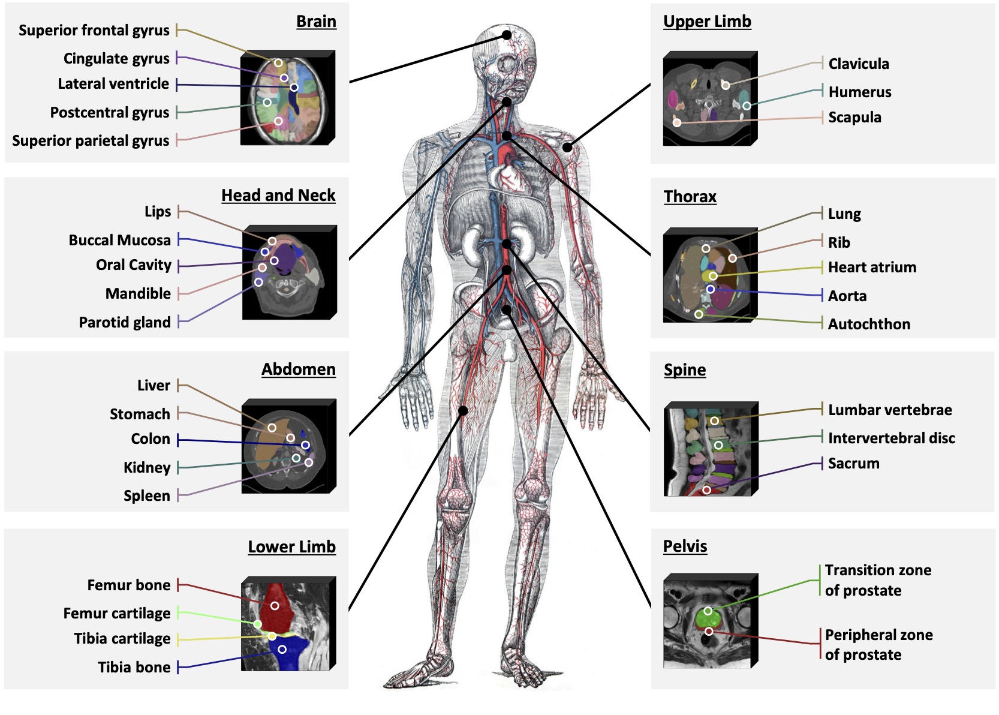

# SAT-DS

This is the official repository to build **SAT-DS**, a medical data collection of **72** public segmentation datasets, contains over **22K** 3D images, **302K** segmentation masks and **497** classes from **3** different modalities (MRI, CT, PET) and **8** human body regions.

This repo can be used to prepare and unfied all these datasets to train [SAT](https://github.com/zhaoziheng/SAT), or any 3D universal medical segmentation model driven by text prompts.

Check our paper "One Model to Rule them All: Towards Universal Segmentation for Medical Images with Text Prompts" for more details.

[ArXiv](https://arxiv.org/abs/2312.17183)

[Website](https://zhaoziheng.github.io/SAT/)



# Step 1: Download datasets
This is the detailed list of all the datasets and their download links.
| Dataset | Download link |
|---|---|
| AbdomenCT1K | https://github.com/JunMa11/AbdomenCT-1K |
| ACDC | https://humanheart-project.creatis.insa-lyon.fr/database/ |
| AMOS CT | https://zenodo.org/records/7262581 |
| AMOS MRI | https://zenodo.org/records/7262581 |
| ATLASR2 | http://fcon\_1000.projects.nitrc.org/indi/retro/atlas.html |
| ATLAS | https://atlas-challenge.u-bourgogne.fr |
| autoPET | https://wiki.cancerimagingarchive.net/pages/viewpage.action?pageId=93258287 |
| Brain Atlas | http://brain-development.org/ |
| BrainPTM | https://brainptm-2021.grand-challenge.org/ |
| BraTS2023 GLI | https://www.synapse.org/\#!Synapse:syn51514105 |
| BraTS2023 MEN | https://www.synapse.org/\#!Synapse:syn51514106 |
| BraTS2023 MET | https://www.synapse.org/\#!Synapse:syn51514107 |
| BraTS2023 PED | https://www.synapse.org/\#!Synapse:syn51514108 |
| BraTS2023 SSA | https://www.synapse.org/\#!Synapse:syn51514109 |
| BTCV Abdomen | https://www.synapse.org/\#!Synapse:syn3193805/wiki/217789 |
| BTCV Cervix | https://www.synapse.org/Synapse:syn3378972 |
| CHAOS CT | https://chaos.grand-challenge.org/ |
| CHAOS MRI | https://chaos.grand-challenge.org/ |
| CMRxMotion | https://www.synapse.org/\#!Synapse:syn28503327/files/ |
| Couinaud | https://github.com/GLCUnet/dataset |
| COVID-19 CT Seg | https://github.com/JunMa11/COVID-19-CT-Seg-Benchmark |
| CrossMoDA2021 | https://crossmoda.grand-challenge.org/Data/ |
| CT-ORG | https://wiki.cancerimagingarchive.net/pages/viewpage.action?pageId=61080890 |
| CTPelvic1K | https://zenodo.org/record/4588403\#\.YEyLq\_0zaCo |
| DAP Atlas | https://github.com/alexanderjaus/AtlasDataset |
| FeTA2022 | https://feta.grand-challenge.org/data-download/ |
| FLARE22 | https://flare22.grand-challenge.org/ |
| FUMPE | https://www.kaggle.com/datasets/andrewmvd/pulmonary-embolism-in-ct-images |
| HAN Seg | https://zenodo.org/record/ |
| HECKTOR2022 | https://hecktor.grand-challenge.org/Data/ |
| INSTANCE | https://instance.grand-challenge.org/Dataset/ |
| ISLES2022 | http://www.isles-challenge.org/ |
| KiPA22 | https://kipa22.grand-challenge.org/dataset/ |
| KiTS23 | https://github.com/neheller/kits23 |
| LAScarQS2022 Task 1 | https://zmiclab.github.io/projects/lascarqs22/data.html |
| LAScarQS2022 Task 2 | https://zmiclab.github.io/projects/lascarqs22/data.html |
| LNDb | https://zenodo.org/record/7153205\#\.Yz\_oVHbMJPZ |
| LUNA16 | https://luna16.grand-challenge.org/ |
| MM-WHS CT | https://mega.nz/folder/UNMF2YYI\#1cqJVzo4p\_wESv9P\_pc8uA |
| MM-WHS MR | https://mega.nz/folder/UNMF2YYI\#1cqJVzo4p\_wESv9P\_pc8uA |
| MRSpineSeg | https://www.cg.informatik.uni-siegen.de/en/spine-segmentation-and-analysis |
| MSD Cardiac | http://medicaldecathlon.com/ |
| MSD Colon | http://medicaldecathlon.com/ |
| MSD HepaticVessel | http://medicaldecathlon.com/ |
| MSD Hippocampus | http://medicaldecathlon.com/ |
| MSD Liver | http://medicaldecathlon.com/ |
| MSD Lung | http://medicaldecathlon.com/ |
| MSD Pancreas | http://medicaldecathlon.com/ |
| MSD Prostate | http://medicaldecathlon.com/ |
| MSD Spleen | http://medicaldecathlon.com/ |
| MyoPS2020 | https://mega.nz/folder/BRdnDISQ\#FnCg9ykPlTWYe5hrRZxi-w |
| NSCLC | https://wiki.cancerimagingarchive.net/pages/viewpage.action?pageId=68551327} \\
| Pancreas CT | https://wiki.cancerimagingarchive.net/display/public/pancreas-ct |
| Parse2022 | https://parse2022.grand-challenge.org/Dataset/ |
| PDDCA | https://www.imagenglab.com/newsite/pddca/ |
| PROMISE12 | https://promise12.grand-challenge.org/Details/ |
| SEGA | https://multicenteraorta.grand-challenge.org/data/ |
| SegRap2023 Task1 | https://segrap2023.grand-challenge.org/ |
| SegRap2023 Task2 | https://segrap2023.grand-challenge.org/ |
| SegTHOR | https://competitions.codalab.org/competitions/21145\#learn\_the\_details |
| SKI10 | https://ambellan.de/sharing/QjrntLwah |
| SLIVER07 | https://sliver07.grand-challenge.org/ |
| ToothFairy | https://ditto.ing.unimore.it/toothfairy/ |
| TotalSegmentator Cardiac | https://zenodo.org/record/6802614 |
| TotalSegmentator Muscles | https://zenodo.org/record/6802614 |
| TotalSegmentator Organs | https://zenodo.org/record/6802614 |
| TotalSegmentator Ribs | https://zenodo.org/record/6802614 |
| TotalSegmentator Vertebrae | https://zenodo.org/record/6802614 |
| TotalSegmentator V2 | https://zenodo.org/record/6802614 |
| VerSe | https://github.com/anjany/verse |
| WMH | https://wmh.isi.uu.nl/ |
| WORD | https://github.com/HiLab-git/WORD} |

# Step 2: Preprocess datasets with uniform format
For each dataset, we need to find all the image and mask pairs, and another 5 basic information: dataset name, modality, label name, patient ids (to split train-test set) and official split (if provided). \
In `processor.py`, we customize the process procedure for each dataset, to generate a jsonl file including these information for each sample. \
Take ACDC for instance, you need to run the following command:
```
python processor.py --dataset_name ACDC --root_path 'SAT-DS/datasets/ACDC/database' --jsonl_dir 'SAT-DS/jsonl_files'
```
`root_path` should be where you download and place the data, `jsonl_dir` should be where you plan to place the jsonl files. \
Note that in this step, we may convert the image and mask into new nifiti files for some datasets, such as TotalSegmentator and so on. So it may take some time.

# Step 3: Load data with uniform format
With the generated jsonl file, a dataset is ready to be used. \
However, when mixing all the datasets to train a universal segmentation model, we need to apply normalization on the image intensity, orientation, spacing across all the datasets, and adjust labels if necessary. \
We realize this by customizing the load script for each dataset in `loader.py`. For each sample, the loader will output: \
`img`: tensor with shape `1, H, W, D`; \
`mask`: binary tensor with shape `N, H, W, D`, `N` corresponds to the number of classes; \
`labels`: a list of `N` class name, corresponds to each channel of `mask`; \
`modality`: MRI, CT or PET. \
We also offer the shortcut to visualize and check any sample in any dataset, for example, to visualize the first sample in ACDC, just run the following command:
```
python loader.py --visualization_dir 'SAT-DS/visualization' --path2jsonl 'SAT-DS/jsonl_files/ACDC.jsonl' --i 0
```

# (Optional) Step 4: Split train and test set
We offer the train-test split used in our paper for each dataset in json files. To follow our split and benchmark your method, simply run this command:
```
python train_test_split.py --jsonl2split 'SAT-DS/jsonl_files/ACDC.jsonl' --train_jsonl 'SAT-DS/trainsets/ACDC.jsonl' --test_jsonl 'SAT-DS/testsets/ACDC.jsonl' --split_json 'split_json/ACDC'
```
This will split the jsonl file into train and test.
